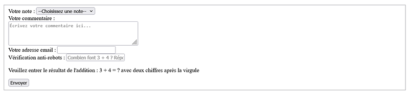
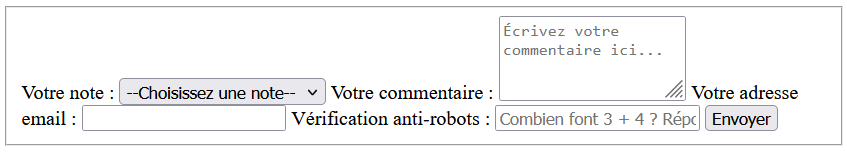
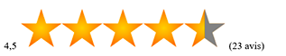
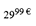
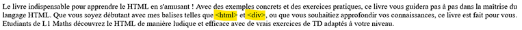
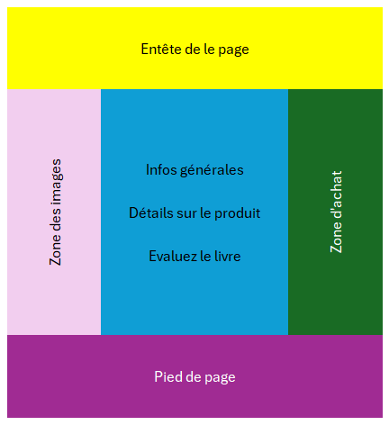

# Bilan de la correction des fichiers rendus

<!-- TOC tocDepth:2..3 chapterDepth:2..6 -->

- [1. Le HTML](#1-le-html)
  - [1.1. Dans le détail](#11-dans-le-détail)
  - [1.2. Le formulaire d'évaluation du livre](#12-le-formulaire-dévaluation-du-livre)
  - [1.3. Les titres](#13-les-titres)
  - [1.4. En vrac](#14-en-vrac)
- [2. Le CSS](#2-le-css)
- [3. Rappels sur le CSS](#3-rappels-sur-le-css)
  - [3.1. Sélecteurs de base](#31-sélecteurs-de-base)
  - [3.2. Pseudo-classes](#32-pseudo-classes)
- [4. Les bordures en CSS](#4-les-bordures-en-css)
- [5. Quelques propriétés CSS utiles pour le rendu attendu](#5-quelques-propriétés-css-utiles-pour-le-rendu-attendu)
- [6. La grille CSS du sujet](#6-la-grille-css-du-sujet)
  - [6.1. Définir la grille dans le HTML](#61-définir-la-grille-dans-le-html)
  - [6.2. Définir la grille dans le CSS](#62-définir-la-grille-dans-le-css)
  - [6.3. Quelques erreurs fréquentes dans la réalisation de la grille CSS](#63-quelques-erreurs-fréquentes-dans-la-réalisation-de-la-grille-css)
- [7. Correction du sujet](#7-correction-du-sujet)

<!-- /TOC -->

Ce document présente un bilan de la correction des fichiers rendus par les étudiants pour le contrôle continu HTML/CSS, qui portait sur la réalisation d'une page web en HTML et CSS à partir de deux captures d'écran et d'instructions. Les exemples de code présentés dans ce document sont des extraits de la correction, et ne représentent pas nécessairement le code complet ou exact qui a été corrigé. De plus, ils représentent une solution possible parmi d'autres, et il est tout à fait possible que d'autres solutions soient également correctes, tant qu'elles respectent les instructions et le rendu attendu.

## 1. Le HTML

Pour commencer, vous disposiez d'une capture d'écran de la page web à réaliser, sans CSS : elle vous présentait donc uniquement la structure de la page, avec les éléments suivants :

- Le logo du site, une image
- 4 liens de navigation
- Des images de la couverture du livre, et de la quatrième de couverture
- le titre de la page et du livre
- etc.

Il fallait donc obtenir, dans un premier temps, une page HTML structurée de manière à ce que les éléments soient présents, et dans le même ordre que la capture d'écran. Cet ordre est important, car c'est sur lui ensuite qu'il fallait ajouter une feuille de style CSS pour obtenir le rendu final.

### 1.1. Dans le détail

#### 1.1.1. Le logo du site

Je reviens sur l'ajout d'une image en HTML, car c'est un point qui a pu poser problème :

En HTML, on ajoute une image à l'aide de la balise ``, qui est une balise auto-fermante, c'est à dire qu'elle ne nécessite pas de balise de fermeture. Elle doit cependant comporter au moins un attribut : `src`, qui indique le chemin vers l'image à afficher ainsi qu'un attribut `alt`, qui fournit une description alternative de l'image. Par exemple :

```html

```

Quand dans les instructions, il était indiqué :

> Le logo 'Athalante' en haut à gauche correspond au fichier ``logo_athalante.png``. Son texte alternatif est "Logo d'Athalante - Site de commerce".

Il fallait donc ajouter une image avec la balise ``, en utilisant l'attribut `src` pour indiquer le chemin vers le fichier `logo_athalante.png`, et l'attribut `alt` pour fournir la description alternative "Logo d'Athalante - Site de commerce". Ce qui donnait le code suivant :

```html

```

Attention aux chemins absolus et relatifs : si le fichier `logo_athalante.png` se trouve dans le même dossier que votre fichier HTML, alors le chemin relatif est simplement `logo_athalante.png`. Il ne fallait pas utiliser un chemin absolu comme `file:///home/2200000t/public_html/CC/logo_athalante.png`, car ce chemin ne fonctionnerait que sur votre ordinateur, et pas sur celui de quelqu'un d'autre qui ouvrirait votre fichier HTML.

> Voir aussi [Retour sur le TD1](https://github.com/knightofnet/25-26-html-web/blob/main/TD2/Retour%20sur%20le%20TD1.md#images-et-chemins-relatifs)

#### 1.1.2. Les 4 liens de navigation

En HTML, on crée un lien hypertexte à l'aide de la balise `<a>`, qui doit comporter au moins un attribut : `href`, qui indique la destination du lien. Le texte ou les éléments placés entre les balises d'ouverture et de fermeture de `<a>` sont cliquables et redirigent vers la destination spécifiée dans l'attribut `href`. Par exemple :

```html
<a href="http://exemple.com">Texte du lien</a>
```

Lorsque le navigateur affiche ce lien HTML, le texte "Texte du lien" est cliquable (souvent affiché en bleu, et souligné), et lorsqu'on clique dessus, l'utilisateur est redirigé vers l'URL `http://exemple.com`.

Quatre liens de navigation devaient être présents dans le haut de la page :

- Le premier lien "Accueil" pointe vers la page courante. Autrement dit, ce lien pointe vers le fichier que vous étiez en train de créer. Ce qui donnait :

```html
<a href="#">Accueil</a>
```

- Le deuxième lien "Produits" pointe vers cette URL : ``http://site.athalante.fr/produits`` [cette URL fictive n'est pas accessible, c'est normal]. Cette fois-ci, une URL 'externe' était demandée, c'est à dire une URL qui ne pointe pas vers la page courante, mais vers une autre page. Ce qui donnait :

```html
<a href="http://site.athalante.fr/produits">Produits</a>
```

- Le troisième lien "Contact" permet d'envoyer un email à l'adresse ``contact@athalante.fr`` [adresse email fictive]. Ce lien là était un peu particulier, car il ne pointait pas vers une page web, mais vers une adresse email. Pour créer un lien qui permet d'envoyer un email, on utilise le protocole `mailto:` suivi de l'adresse email. Ce qui donnait :

```html
<a href="mailto:contact@athalante.fr">Contact</a>
```

> Sur Celene, [Cours 2d. HTML : Créer des liens, diapo 9](https://celene.univ-tours.fr/mod/resource/view.php?id=902393)

- Le quatrième lien "À propos" ne pointe vers aucune page (utilisez # à la place de l'URL cible). Il s'agissait ici juste d'un lien sans destination, qui ne mène nulle part. Il était demandé d'utiliser `#` comme valeur de l'attribut `href` pour indiquer que ce lien ne pointe vers aucune page. Ce qui donnait :

```html
<a href="#">À propos</a>
```

### 1.2. Le formulaire d'évaluation du livre

Une partie qui n'a pas été toujours très bien réalisée est le formulaire d'évaluation du livre, qui devait comporter les éléments suivants :

- A. Une liste déroulante pour choisir la note de 1 à 5, avec un choix par défaut de "--Choisissez une note--".
- B. Une zone de texte pour saisir un commentaire sur le livre (grand texte). Cette zone de texte doit indiquer à l'utilisateur ce qu'il doit saisir : "Écrivez votre commentaire ici...".
- C. Un champ de saisie pour l'adresse email de l'utilisateur.
- D. Un champ de saisie pour la vérification anti-robots :
  - Le champ de saisie doit indiquer à l'utilisateur ce qu'il doit saisir : "Combien font 3 + 4 ? Réponse au format 000,00".
  - ce champ de saisie porte une contrainte sous la forme d'une expression régulière. L’utilisateur doit saisir comme résultat un nombre avec une partie entière de 1 à 3 chiffres, suivie d'une virgule, suivie de deux chiffres. L'expression régulière à utiliser pour cette contrainte est la suivante : ``[\d]{1,3},[\d]{2}``.

#### 1.2.1. Formulaire en HTML

Avant de commencer, il faut se rappeler qu'un formulaire en HTML est créé à l'aide de la balise `<form>`, qui peut contenir différents types d'éléments de formulaire tels que des champs de saisie, des listes déroulantes, des zones de texte, etc. Chaque élément de formulaire doit être correctement structuré et associé à une étiquette pour garantir une bonne accessibilité.

La balise `<form>`comporte généralement :

- un attribut `action`, qui indique l'URL vers laquelle les données du formulaire seront envoyées lorsque l'utilisateur soumettra le formulaire. Par exemple : `action="submit_form.php"`.
- un attribut `method`, qui indique la méthode HTTP utilisée pour envoyer les données du formulaire. Les méthodes les plus courantes sont `GET` et `POST`. Par exemple : `method="post"`.

Si un de ces attributs n'est pas spécifié, le formulaire utilisera des valeurs par défaut : `action` par défaut est la page courante, et `method` par défaut est `GET`.

*Exemple de base d'un formulaire en HTML :*

```html
<form action="submit_form.php" method="post">
  <!-- éléments de formulaire ici -->
</form>
```

#### 1.2.2. Les éléments du formulaire d'évaluation du livre

En observant la capture d'écran, on pouvait voir que le formulaire d'évaluation du livre était structuré de la manière suivante :

- Un cadre qui entoure l'ensemble des éléments du formulaire. Ce cadre ne peut pas être du CSS, puisqu'il est visible sur la capture d'écran sans CSS. Il s'agit donc d'un élément HTML qui doit être utilisé pour créer ce cadre. L'élément HTML le plus approprié pour cela est la balise `<fieldset>`, qui permet de regrouper des éléments de formulaire et de les entourer d'un cadre.
- Le champ `A.` correspond à une liste déroulante, qui en HTML est créée à l'aide de la balise `<select>`, avec des éléments `<option>` pour chaque choix de note. Le choix par défaut "--Choisissez une note--" doit être défini comme une option avec l'attribut `selected`. *Par exemple :*

```html
<select name="note">
  <option value="" selected>--Choisissez une note--</option>
  <option value="1">1</option>
  <option value="2">2</option>
  <option value="3">3</option>
  <option value="4">4</option>
  <option value="5">5</option>
</select>
```

- Le champ `B.` correspond à une zone de texte pour saisir un commentaire sur le livre. En HTML, on a deux options pour créer une zone de texte :
  - La balise `<input type="text">` qui crée un champ de saisie à une seule ligne.
  - La balise `<textarea>` qui crée une zone de texte à plusieurs lignes.
  
  Dans ce cas du champ `B.`, il fallait observer que le champs fait plusieurs lignes, donc il fallait utiliser la balise `<textarea>`. De plus, il fallait ajouter un texte d'indication à l'intérieur de la zone de texte pour indiquer à l'utilisateur ce qu'il doit saisir. En HTML, on utilise l'attribut `placeholder` pour cela.

  Enfin, il fallait également ajouter l'attribut `required` pour indiquer que ce champ est obligatoire et doit être rempli avant de soumettre le formulaire.

  On obtenait donc le code suivant pour le champ `B.` :

```html
<textarea id="comment" name="comment" rows="4" placeholder="Écrivez votre commentaire ici..." required>
</textarea>
```

- Le champ `C.` correspond à un champ de saisie pour l'adresse email de l'utilisateur. En HTML, on utilise la balise `<input>` avec l'attribut `type="email"` pour créer un champ de saisie spécifiquement destiné à la saisie d'une adresse email.

  Ce type de champ inclut une validation intégrée pour s'assurer que l'utilisateur saisit une adresse email valide.

  De plus, il fallait ajouter l'attribut `required` pour indiquer que ce champ est obligatoire.

  On obtenait donc le code suivant pour le champ `C.` :

```html
<input type="email" id="email" name="email" required>
```

- Le champ `D.` correspond à un champ de saisie pour la vérification anti-robots. En HTML, on utilise la balise `<input>` avec l'attribut `type="text"` pour créer un champ de saisie à une ligne.

  Il fallait également ajouter un texte d'indication à l'intérieur du champ de saisie pour indiquer à l'utilisateur ce qu'il doit saisir, en utilisant l'attribut `placeholder`.

  Enfin, il fallait ajouter une contrainte de validation sous la forme d'une expression régulière pour s'assurer que l'utilisateur saisit une réponse au format spécifié. En HTML, on utilise l'attribut `pattern` pour cela. L'expression régulière était donnée dans les instructions : ``[\d]{1,3},[\d]{2}``.

  On obtenait donc le code suivant pour le champ `D.` :

```html
<input type="text" id="captcha" name="captcha" placeholder="Combien font 3 + 4 ? Réponse au format 000,00" pattern="[\d]{1,3},[\d]{2}" required>
```

**Remarques :**

- Notez bien que tous les champs du formulaire étaient marqués comme `required`, ce qui signifie qu'ils devaient être remplis avant de pouvoir soumettre le formulaire.
- Dans les exemples de code ci-dessus, les attributs `id` et `name` ont des valeurs qui dépendent de votre choix, mais il est important de les inclure pour que le formulaire soit fonctionnel - surtout `name` qui permet de traiter correctement les données lors de la soumission.

#### 1.2.3. Le formulaire au final

Dans le point précédent, nous avons vu comment créer les différents éléments du formulaire d'évaluation du livre.

**Extrait de la capture d'écran - Formulaire attendu :**



D'après la capture, chaque élément, chaque champ est accompagné d'un texte d'indication (`Votre note`, `Votre commentaire`, etc.) qui indique à l'utilisateur ce qu'il doit saisir dans le champ correspondant. En HTML, on utilise la balise `<label>` pour associer un texte d'indication à un champ de formulaire. *Par exemple, pour le champ `A.`, on pouvait écrire :*

```html
<label for="note">Votre note :</label>
<select id="note" name="note">
  <option value="" selected>--Choisissez une note--</option>
  <option value="1">1 étoile</option>
  <option value="2">2 étoiles</option>
  <option value="3">3 étoiles</option>
  <option value="4">4 étoiles</option>
  <option value="5">5 étoiles</option>
</select>
```

Il fallait faire de même pour les autres champs du formulaire, en utilisant des balises `<label>` pour chaque champ, et en associant chaque label à son champ correspondant à l'aide de l'attribut `for` qui doit correspondre à l'attribut `id` du champ. Pour le champ `A.` on avait `for="note"` dans le label, et `id="note"` dans le champ de saisie.

Au final, le formulaire d'évaluation du livre devait ressembler à ceci :

```html
<form action="submit_form.php" method="post">
  <fieldset>

    <label for="note">Votre note :</label>
    <select id="note" name="note" required>
      <option value="" selected>--Choisissez une note--</option>
      <option value="1">1 étoile</option>
      <option value="2">2 étoiles</option>
      <option value="3">3 étoiles</option>
      <option value="4">4 étoiles</option>
      <option value="5">5 étoiles</option>
    </select>

    <label for="comment">Votre commentaire :</label>
    <textarea id="comment" name="comment" rows="4" placeholder="Écrivez votre commentaire ici..." required></textarea>

    <label for="email">Votre adresse email :</label>
    <input type="email" id="email" name="email" required>

    <label for="captcha">Vérification anti-robots :</label>
    <input type="text" id="captcha" name="captcha" placeholder="Combien font 3 + 4 ? Réponse au format 000,00" pattern="[\d]{1,3},[\d]{2}" required>

    <button type="submit">Envoyer</button>
  </fieldset>
</form>
```

> Voir le [code dans un fichier HTML](bilanCC_ress/page-HtmlSeul-formulaire-A.html)

En réalité, ce n'est pas totalement fini. Avec le code présenté ci-dessus, on a tous les éléments du formulaire, mais ils ne sont pas encore organisés de la même manière que sur la capture d'écran de ce qui était attendu.

**Capture d'écran du formulaire non organisé :**



Il fallait regrouper les labels et les champs de saisie de manière à ce qu'ils apparaissent côte à côte, par ligne. Pour forcer les éléments à apparaître sur des lignes séparées, on pouvait les entourer de balises `<div>` ou de balises `<p>`, qui sont des éléments de bloc en HTML. *Par exemple, pour le champ `A.`, on pouvait écrire :*

```html
<div>
  <label for="note">Votre note :</label>
  <select id="note" name="note" required>
    <option value="" selected>--Choisissez une note--</option>
    <option value="1">1 étoile</option>
    <option value="2">2 étoiles</option>
    <option value="3">3 étoiles</option>
    <option value="4">4 étoiles</option>
    <option value="5">5 étoiles</option>
  </select>
</div>
```

Soit pour le formulaire entier :

```html
<form method="post" action="ficVide.php">
    <fieldset>

        <div>
            <label for="note">Votre note :</label>
            <select id="note" name="note" required>
                <option value="">--Choisissez une note--</option>
                <option value="1">1 étoile</option>
                <option value="2">2 étoiles</option>
                <option value="3">3 étoiles</option>
                <option value="4">4 étoiles</option>
                <option value="5">5 étoiles</option>
            </select>
        </div>


        <div>
            <label for="comment">Votre commentaire :</label>
            <br>
            <textarea id="comment" name="comment" rows="4" placeholder="Écrivez votre commentaire ici..." required></textarea>
        </div>

        <div>
            <label for="email">Votre adresse email :</label>
            <input type="email" id="email" name="email" required>
        </div>

        <div>
            <label for="captcha">Vérification anti-robots :</label>
            <input type="text" id="captcha" name="captcha" required
                placeholder="Combien font 3 + 4 ? Réponse au format 000,00"
                pattern="[\d]{1,3},[\d]{2}">

            <!-- avec une phrase d'indication après le champ de saisie -->
            <p>Veuillez entrer le résultat de l'addition : 3 + 4 = ? avec deux chiffres après la virgule
            </p>

        </div>

        <div>
            <button type="submit">Envoyer</button>
        </div>

    </fieldset>
</form>
```

Voici quelques erreurs fréquentes dans la réalisation de ce formulaire, notamment :

- L'oubli de la balise `<fieldset>` pour entourer les éléments du formulaire.
- L'utilisation de la balise `<input type="text">` au lieu de `<textarea>` pour le champ de commentaire, ce qui ne correspondait pas à la capture d'écran.
- L'oubli de l'attribut `placeholder` pour les champs de saisie, ce qui rendait l'interface moins claire pour l'utilisateur.
- L'oubli de l'attribut `required` pour les champs du formulaire, ce qui permettait de soumettre le formulaire sans remplir les champs obligatoires.
- L'oubli de l'attribut `pattern` pour le champ de vérification anti-robots, ce qui permettait de soumettre des réponses au format incorrect.

### 1.3. Les titres

Dans la page à réaliser, il y avait des titres à repérer. En HTML, on utilise les balises de titre `<h1>`, `<h2>`, `<h3>`, etc. pour structurer le contenu en titres et sous-titres. La balise `<h1>` est utilisée pour le titre principal de la page, tandis que les balises `<h2>`, `<h3>`, etc. sont utilisées pour les sous-titres et les titres de sections.

Comment savoir quels titres utiliser pour chaque élément de la page ? Il fallait se référer à la capture d'écran, et observer :

- Dans un premier temps, il faut chercher le plus grand titre de la page, qui est généralement le titre principal. Dans la capture d'écran, le titre principal était "Livre - Apprendre le HTML à la fac", qui devait donc être entouré de la balise `<h1>`. Il ne peut y avoir qu'un seul titre `<h1>` par page, car il représente le sujet principal de la page. Donc, forcément, les autres titres devaient être des titres de niveau inférieur.
- On observe 3 autres titres sur la page : "Détails sur le produit", "Evaluez le livre" et "Infos sur l'expédition". Les deux premiers semblent être de même niveau, car ils sont présentés de manière similaire sur la capture d'écran, tandis que le troisième semble être un titre de niveau inférieur, car il est présenté de manière moins proéminente. On pouvait donc utiliser `<h2>` pour les titres "Détails sur le produit" et "Evaluez le livre", et `<h3>` pour le titre "Infos sur l'expédition".

### 1.4. En vrac

#### 1.4.1. La sous-partie de la note



Avec la capture, vous pouviez observer une partie où la note du livre était affichée en texte, puis avec une image (des étoiles) et enfin, le nombre d'avis était indiqué entre parenthèses. Il fallait reproduire cette partie en HTML, en utilisant les éléments suivants :

```html
<p>
    4,5  (23 avis)
</p>
```

Le texte "4,5" représente la note du livre, l'image "4.5_stars.png" représente la note en étoiles, et le texte "(23 avis)" indique le nombre d'avis. Le tout est entouré d'une balise `<p>` pour indiquer qu'il s'agit d'un paragraphe de texte. Du fait que ces éléments soient placés sur la même ligne dans la capture d'écran, il fallait les placer dans la même balise de bloc (ici, une balise `<p>`), pour qu'ils apparaissent côte à côte.

#### 1.4.2. Le prix avec la partie décimale en exposant



Autre particularité, le prix étaient indiqué en deux parties : la partie entières était affichée normalement, tandis que la partie décimale était affichée en exposant (en petit, en haut). En HTML, on utilise la balise `<sup>` pour afficher du texte en exposant. *Par exemple, pour afficher le prix "29,99€" avec la partie décimale en exposant, on pouvait écrire :*

```html
<p>
    29,<sup>99 €</sup>
</p>
```

#### 1.4.3. Les balises &lt;div&gt; et &lt;span&gt; dans la description

Dans la description du livre se trouvaient deux balises HTML qui étaient observable sur la capture d'écran : une balise `<div>` et une balise `<span>`.



Le souci, c'est que si dans le code HTML de votre page, vous écriviez directement les balises `<div>` et `<html>`, `<span>` (selon le sujet), alors elles seraient interprétées comme des éléments HTML par le navigateur (normal, c'est ce qu'elles sont !), et non comme du texte à afficher. Par conséquent, elles ne seraient pas visibles sur la page, car elles seraient traitées comme des éléments de structure plutôt que comme du contenu textuel.

Pour qu'elles soient affichées comme du texte il fallait échapper les caractères spéciaux `<` et `>` en utilisant les entités HTML correspondantes : `&lt;` pour `<` et `&gt;` pour `>`.

*Par exemple, pour afficher la balise `<div>` dans le texte, on pouvait écrire :*

```html
<p>
    La balise &lt;div&gt; est un conteneur de bloc en HTML.
</p>
<p>
    La balise &lt;span&gt; est un conteneur en ligne en HTML.
</p>
```

## 2. Le CSS

Une fois le HTML de la page réalisé, il fallait ajouter une feuille de style CSS pour obtenir le rendu final qui correspondait à la seconde capture d'écran. Il fallait donc créer un second fichier, avec l'extension `.css`, et y ajouter les règles de style nécessaires pour faire correspondre le rendu de la page à la capture d'écran.

Afin de relier la feuille de style CSS à la page HTML, il fallait utiliser la balise `<link>` dans la section `<head>` du document HTML. *Par exemple, si votre fichier CSS s'appelle `style.css`, vous deviez ajouter la ligne suivante dans la section `<head>` de votre fichier HTML :*

```html
<head>
  ...
  <link rel="stylesheet" href="style.css">
</head>
```

## 3. Rappels sur le CSS

Un fichier CSS est composé de **règles de style**. Chaque règle de style est constituée d'un **sélecteur** et d'un **bloc de déclaration**. Le sélecteur indique à quel élément HTML la règle de style s'applique, tandis que le bloc de déclaration contient une ou plusieurs déclarations de style qui définissent les propriétés CSS à appliquer à cet élément. *Par exemple, la règle de style suivante :*

```css
p {
  color: red;
  font-size: 16px;
}
```

Applique les styles définis dans le bloc de déclaration (couleur rouge et taille de police de 16 pixels) à tous les éléments `<p>` du document HTML, car le sélecteur est `p`, qui correspond à la balise de paragraphe en HTML.

Il s'agit d'une règle de style très simple, qui utilise un **sélecteur de base** (ou sélecteur de type), qui cible tous les éléments `<p>` du document. Cependant, il existe de nombreux autres types de sélecteurs en CSS, tels que les sélecteurs de classe, les sélecteurs d'identifiant, les sélecteurs d'attribut, etc., qui permettent de cibler des éléments HTML de manière plus précise et spécifique.

### 3.1. Sélecteurs de base

- **Sélecteur de type** : cible tous les éléments d'un type spécifique. *Par exemple, `p` cible tous les éléments `<p>`*.
- **Sélecteur de classe** : cible tous les éléments qui ont une classe spécifique. *Par exemple, `.highlight` cible tous les éléments qui ont la classe "highlight"*.
  
  Côté HTML, on ajoute une classe à un élément en utilisant l'attribut `class`. *Par exemple :*

  ```html
  <p class="highlight">Ce paragraphe est mis en évidence.</p>
  ```

  Ici le paragraphe a la classe "highlight", ce qui signifie que les styles définis pour le sélecteur `.highlight` en CSS seront appliqués à ce paragraphe.

  Un élément HTML peut avoir plusieurs classes en même temps, en les séparant par des espaces dans l'attribut `class`. *Par exemple :*

  ```html
  <p class="highlight important">Ce paragraphe est mis en évidence et est important.</p>
  ```

  Ici, le paragraphe a deux classes : "highlight" et "important". Les styles définis pour les sélecteurs `.highlight` et `.important` en CSS seront tous les deux appliqués à ce paragraphe.

- **Sélecteur d'identifiant** : cible un élément qui a un identifiant spécifique. *Par exemple, `#main-title` cible l'élément qui a l'identifiant "main-title"*.

  Coté HTML, on ajoute un identifiant à un élément en utilisant l'attribut `id`. *Par exemple :*

  ```html
  <h1 id="main-title">Titre principal de la page</h1>
  ```

  Ici, le titre a l'identifiant "main-title", ce qui signifie que les styles définis pour le sélecteur `#main-title` en CSS seront appliqués à ce titre.

  Contrairement aux classes, un **identifiant doit être unique** dans un document HTML. Cela signifie qu'il ne peut y avoir qu'un seul élément avec l'identifiant "main-title" dans la page. Si vous essayez d'utiliser le même identifiant pour plusieurs éléments, cela peut entraîner des problèmes de style et de comportement inattendus.

- **Sélecteur descendant** : cible les éléments qui sont des descendants d'un autre élément. *Par exemple, `div p` cible tous les éléments `<p>` qui sont des descendants d'un élément `<div>`*.

- **Sélecteur de groupe** : cible plusieurs éléments en même temps. *Par exemple, `h1, h2, h3` cible tous les éléments `<h1>`, `<h2>` et `<h3>`*.

### 3.2. Pseudo-classes

Dans les instructions du contrôle continu, il était demandé d'ajouter des styles pour les liens hypertexte, afin qu'ils changent de couleur lorsqu'on passe la souris dessus. En CSS, on utilise les pseudo-classes pour définir des styles qui s'appliquent à un élément dans un état particulier. Par exemple, la pseudo-classe `:hover` s'applique à un élément lorsque l'utilisateur passe la souris dessus (`hover` pour survol en anglais).

*Exemple d'utilisation de la pseudo-classe `:hover` pour les liens de navigation :*

```css
a {
  color: #007bff; 
  margin : 0 10px; /* une marge de 10 pixels à gauche et à droite de chaque lien et une marge de 0 pixel en haut et en bas */
  text-decoration: none; /* pour enlever le soulignement des liens */
}

/** Au survol, la couleur du texte devient rouge orangé */
a:hover {
  color: #ff4500; 
}
```

## 4. Les bordures en CSS

Pour certains éléments, il était demandé d'ajouter une bordure. En CSS, on utilise la propriété `border` pour ajouter une bordure à un élément. La propriété `border` est une propriété raccourcie qui permet de définir la largeur, le style et la couleur de la bordure en une seule déclaration.

*Par exemple, pour ajouter une bordure de 1 pixel de largeur, de style solide et de couleur noire à un élément, on peut écrire :*

```css
.element {
  border: 1px solid black;
}
```

L'énoncé indiquait que le titre de niveau 1 ainsi que les titres de niveau 2 avaient en commun d'avoir :

- une couleur de texte bleu canard (`#008080`),
- une bordure inférieure en pointillés de la même couleur.

Voici comment on pouvait écrire cela en CSS :

```css
h1, h2 {
  color: #008080; /* couleur de texte bleu canard */
  border-bottom: 1px dotted #008080; /* bordure inférieure en pointillés de la même couleur */
}
```

Ensuite, il était indiqué que les titres de niveau 1 devaient avoir une marge extérieure supérieure nulle, une bordure inférieure de `2px` et une marge intérieure inférieure de `15px`. Quand aux titres de niveau 2 ils devaient avoir une marge extérieure supérieure de `1.5rem` et une bordure inférieure de `1px`.

On pouvait donc compléter la règle de style précédente pour les titres de niveau 1 et de niveau 2 de la manière suivante :

```css
h1 {
  margin-top: 0; /* marge extérieure supérieure nulle */
  border-bottom-width: 2px; /* bordure inférieure de 2px */
  padding-bottom: 15px; /* marge intérieure inférieure de 15px */
}

h2 {
  margin-top: 1.5rem; /* marge extérieure supérieure de 1.5rem */
}
```

Si on regarde le style de bordure du titre de niveau, il est donc en partie défini dans la règle de style commune à `h1` et `h2`, qui définit le style général de la bordure (couleur, style), et en partie défini dans les règles de style spécifiques à `h1` et `h2`, qui définissent la largeur de la bordure. dans la règle propre à `h1`, on définit la largeur de la bordure à `2px` : la largeur de la bordure va donc surcharger la valeur de `1px` définie dans la règle commune, et la bordure du titre de niveau 1 sera donc de `2px`.

Il est tout à fait possible d'écrire dans une règle - plus générale - la plupart des propriétés communes à plusieurs éléments, et d'écrire dans des règles plus spécifiques les propriétés qui diffèrent entre ces éléments. C'est une bonne pratique pour éviter les redondances dans le code CSS et pour faciliter la maintenance du code.

## 5. Quelques propriétés CSS utiles pour le rendu attendu

**Retirer le soulignement des liens :**

Propriété CSS : `text-decoration`

Valeur : `none`

```css
a {
  text-decoration: none;
}
```

**Justifier le texte :**

Propriété CSS : `text-align`

Valeur : `justify`

```css
p {
  text-align: justify;
}
```

## 6. La grille CSS du sujet

Pour réaliser la mise en page de la page web, il fallait utiliser une grille CSS. C'était indiqué dans les instructions et visible sur la capture d'écran du rendu attendu : la page était organisée en trois colonnes, avec une colonne centrale plus large que les deux colonnes latérales. Il y avait une partie supérieure qui s'étendait sur toute la largeur de la page, et une partie inférieure qui s'étendait également sur toute la largeur de la page.

Cette organisation correspond à une grille CSS avec 3 colonnes et 3 lignes, où la première ligne contient un élément qui s'étend sur les 3 colonnes, la deuxième ligne contient 3 éléments (un dans chaque colonne), et la troisième ligne contient un élément qui s'étend sur les 3 colonnes.



### 6.1. Définir la grille dans le HTML

Pour réaliser une grille CSS, il faut un ensemble d'éléments HTML.

- **L'élément conteneur de la grille** : c'est l'élément HTML qui va contenir tous les éléments qui vont composer la grille. C'est un élément parent qui englobe tous les éléments de la grille.

  Par exemple, dans notre cas, il fallait entourer l'ensemble du contenu de la page (tout le HTML) avec une balise `<div>` (ou une autre balise de bloc, par exemple `<main>`) qui servira de conteneur pour la grille CSS. *Par exemple :*

  ```html
  <div class="grid-container">
    <!-- tout le contenu de la page ici -->
  </div>
  ```

- **Les éléments de la grille** : ce sont les éléments HTML qui vont être placés dans la grille. Ce sont les éléments **directement enfants du conteneur de la grille**.

  Par exemple, dans notre cas, il fallait organiser le contenu de la page en 5 éléments principaux (un pour la partie supérieure qui s'étend sur toute la largeur, trois pour les colonnes de la deuxième ligne, et un pour la partie inférieure qui s'étend sur toute la largeur). Ces éléments pouvaient être des balises `<div>` ou d'autres balises de bloc, selon votre choix.

  *Par exemple :*

  ```html
  <div class="grid-container">

    <div class="header">
      <!-- contenu de la partie supérieure -->
    </div>

    <div class="left-column">
      <!-- contenu de la colonne de gauche -->
    </div>

    <div class="center-column">
      <!-- contenu de la colonne centrale -->
    </div>

    <div class="right-column">
      <!-- contenu de la colonne de droite -->
    </div>

    <div class="footer">
      <!-- contenu de la partie inférieure -->
    </div>

  </div>
  ```

  ou bien

  ```html

  <!-- Element conteneur de la grille -->
  <main>

    <header>
      <!-- contenu de la partie supérieure -->
      <!-- avec le logo du site et les 4 liens de navigation -->
    </header>

    <div class="product-images">
      <!-- contenu de la colonne de gauche -->
      <!-- avec les images de la couverture du livre et de la quatrième de couverture -->
    </div>

    <article class="product-main">
      <!-- contenu de la colonne centrale -->
      <!-- avec le titre de la page, le titre du livre, la note, le prix, la description, etc. -->
    </article>

    <aside class="zone-achat">
      <!-- contenu de la colonne de droite -->
      <!-- avec la zone d'achat du livre, les informations sur l'expédition, etc. -->
    </aside>

    <footer>
      <!-- contenu de la partie inférieure -->
    </footer>

  </main>
  ```
  
### 6.2. Définir la grille dans le CSS

#### 6.2.1. Pour le conteneur de la grille

Maintenant que la grille est définie dans le HTML, il faut la définir dans le CSS. On commence par ajouter des propriétés au conteneur de la grille :

- Pour indiquer que c'est une grille CSS : propriété `display: grid`
- Pour définir le nombre de colonnes et de lignes, ainsi que la taille de chaque colonne et de chaque ligne : propriétés `grid-template-columns` et `grid-template-rows` (cette dernière était facultative)
- Pour définir les zones de la grille : propriété `grid-template-areas`,
- Eventuellement, pour définir l'espacement entre les éléments de la grille : propriété `gap`.

```css
main {
  display: grid; /* pour indiquer que c'est une grille CSS */
  grid-template-columns: 1fr 2fr 1fr; /* pour définir le nombre de colonnes et la taille de chaque colonne */
  grid-template-areas:
        "h h h"
        "img info achat"
        "f f f"
    ; /* pour définir les zones de la grille */
  gap: 1.5rem; /* pour définir l'espacement entre les éléments de la grille */
  
}
```

#### 6.2.2. Pour les éléments de la grille

Ensuite, il faut ajouter des propriétés aux éléments de la grille pour les placer dans les zones définies dans le conteneur de la grille. Pour cela, on utilise la propriété `grid-area` en indiquant le nom de la zone à laquelle l'élément doit être associé.

```css
header {
  grid-area: h; /* pour placer l'élément dans la zone "h" */
}

.product-images {
  grid-area: img; /* pour placer l'élément dans la zone "img" */
}

.product-main {
  grid-area: info; /* pour placer l'élément dans la zone "info" */
}

.zone-achat {
  grid-area: achat; /* pour placer l'élément dans la zone "achat" */
}

footer {
  grid-area: f; /* pour placer l'élément dans la zone "f" */
}
```

### 6.3. Quelques erreurs fréquentes dans la réalisation de la grille CSS

- Oublier d'ajouter la propriété `display: grid` au conteneur de la grille, ce qui fait que les propriétés de grille ne sont pas appliquées et que les éléments ne sont pas organisés en grille.
- Oublier de définir les zones de la grille avec la propriété `grid-template-areas`, ce qui rend plus difficile le placement des éléments dans la grille.
  - Ecrire les zones de la grille de manière incorrecte :
    *Par exemple :*

    ```css
    grid-template-areas:
          "hhh"
          "imginfoachat"
          "fff"
      ;
    ```

    Ici les zones de la grille ne sont pas correctement définies, car les noms des zones ne sont pas séparés par des espaces. Il faut veiller à séparer les noms des zones par des espaces pour que la grille soit correctement définie.
- Oublier d'ajouter la propriété `grid-area` aux éléments de la grille pour les placer dans les zones définies, ce qui fait que les éléments ne sont pas placés dans la grille comme prévu.
- Oublier d'ajouter la propriété `gap` pour définir l'espacement entre les éléments de la grille, ce qui peut rendre la mise en page plus serrée et moins lisible.
- Oublier de définir la taille des colonnes avec la propriété `grid-template-columns`, ce qui peut faire que les colonnes ne sont pas de la bonne taille et que la mise en page ne correspond pas à la capture d'écran attendue.

## 7. Correction du sujet

La méthode de correction que j'ai utilisée pour corriger ce sujet est la suivante :

- Décomposer les instructions et les points à réaliser le plus possible, afin d'obtenir une liste d'éléments à vérifier dans le code de chaque étudiant.
- Sauf exception, chaque élément donnait 0,25 point, ce qui permettait d'avoir une notation plus précise et plus juste, en attribuant des points pour chaque élément réalisé correctement, même si d'autres éléments n'étaient pas réalisés ou étaient réalisés de manière incorrecte.

La correction des deux sujets (qui se ressemblaient énormément) est disponible dans les fichiers suivants :

- [Correction du sujet - Apprendre le HTML](Sujets/Apprendre%20le%20HTML/)
- [Correction du sujet - Apprendre le CSS](Sujets/Apprendre%20le%20CSS/)
