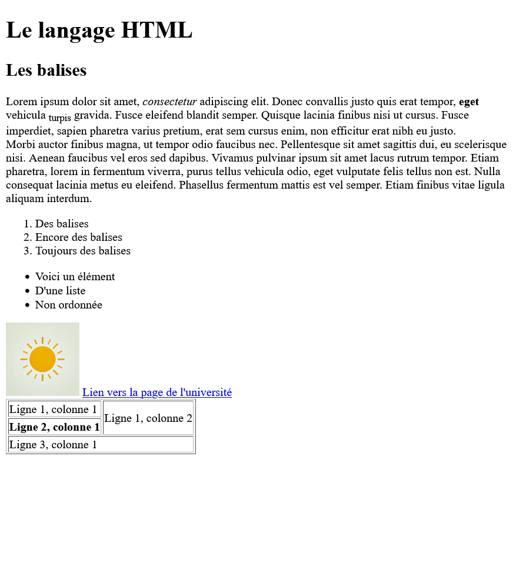

# Bilan TD1 + TD2 — Ce que vous devez maîtriser

## 1) HTML : à quoi ça sert, et ce que c’est vraiment

Le HTML est le langage qui **structure** une page web : il décrit *quoi est quoi* (titre, paragraphe, liste, lien…). Il n'est pas responsable de :

- la mise en forme (couleurs, polices, disposition) — c’est le rôle du CSS ;
- le comportement dynamique (animations, interactions) — c’est le rôle de JavaScript, un langage de programmation qui s'exécute dans le navigateur, donc le client (hors programme).

Autrement dit : le HTML, c’est comme le **plan d’un document** (chapitres, sections, paragraphes). Ce n’est pas la mise en page (ça, ce serait plutôt CSS) ni les actions (ça, ce serait plutôt JavaScript).

Une page HTML est au départ, **un fichier texte** envoyé au navigateur, puis interprété afin d'afficher la page web.

Connaitre le HTML, c’est comprendre la **structure** d’une page web et ainsi savoir comment organiser le contenu.

### Exemple (structure minimale)

**Légende :** “Le squelette minimal d’une page HTML correcte.”

```html
<!-- index.html : squelette minimal -->
<!DOCTYPE html>
<html lang="fr">
  <head>
    <meta charset="utf-8">
    <title>Ma première page</title>
  </head>
  <body>
    <h1>Bonjour</h1>
    <p>Ceci est un paragraphe.</p>
  </body>
</html>
```

### Les balises HTML

Le HTML utilise des **balises** pour structurer le contenu.
Certaines balises sont ouvertes/fermées (exemple  `<p>...</p>`, `<a>...</a>`, `<h1>...</h1>`), d’autres sont auto-fermantes (``, `<br />`, `<input />`).

> [Sur CELENE : 2.a HTML: Syntaxe de base des balises](https://celene.univ-tours.fr/mod/resource/view.php?id=902390)

Voici quelques balises de base à connaître :

- `<!DOCTYPE html>` : indique que c’est du HTML5.
- `<html>` : racine du document HTML.
- `<head>` : méta-informations (titre, encodage, liens CSS…).
- `<title>` : titre de la page (affiché dans l’onglet du navigateur).
- `<body>` : contenu visible de la page.
- `<h1>`, `<h2>`, ... : titres de différentes tailles.
 [Sur CELENE : 2c. HTML : Principales balises Titres, Paragragraphes, Listes](https://celene.univ-tours.fr/mod/resource/view.php?id=902392)
- `<p>` : paragraphe de texte.
- `<ul>`, `<ol>`, `<li>` : listes non ordonnées et ordonnées.
- `<a href="URL">...</a>` : lien hypertexte. [Sur CELENE : 2d. HTML : Créer des liens](https://celene.univ-tours.fr/mod/resource/view.php?id=902393)
- `` : image. [Sur CELENE : 2e. HTML : Insérer des images](https://celene.univ-tours.fr/mod/resource/view.php?id=902394)
- `<table>`, `<tr>`, `<td>`, `<th>` : tableaux (simple).
  - `<thead>`, `<tbody>`, `<tfoot>` : parties du tableau (optionnel).
  - attributs `rowspan`, `colspan` pour fusionner des cellules.
  - [Sur CELENE : 2f. HTML : Tableaux](https://celene.univ-tours.fr/mod/resource/view.php?id=902395)

**Légende :** “Exemple d'une page HTML basique.” :

```HTML
<!DOCTYPE html>
<html lang="fr">

<head>
    <title>Page du TD1 du 12 janvier</title>
    <meta charset="UTF-8">
</head>

<body>

    <h1>Le langage HTML</h1>
    <h2>Les balises</h2>

    <!-- La balise permet d'afficher un paragraphe -->
    <p>
        Lorem ipsum dolor sit amet, <em>consectetur</em> adipiscing elit. Donec convallis justo quis erat tempor,
        <b>eget</b> vehicula <sub>turpis</sub> gravida. Fusce eleifend blandit semper. Quisque lacinia finibus nisi ut
        cursus. Fusce imperdiet, sapien pharetra varius pretium, erat sem cursus enim, non efficitur erat nibh eu justo.
        <br> Morbi auctor finibus magna, ut tempor odio faucibus nec.
    </p>

    <!-- Listes en HTML -->

    <!-- Listes ordonnées -->
    <ol>
        <li>Des balises</li>
        <li>Encore des balises</li>
        <li>Toujours des balises</li>
    </ol>

    <!-- Listes non ordonnées -->
    <ul>
        <li>Voici un élément</li>
        <li>D'une liste</li>
        <li>Non ordonnée</li>
    </ul>

    <!-- Image -->
    

    <!-- Lien vers la page de l'université -->
    <!-- https://univ-tours.fr -->
    <a href="https://univ-tours.fr">Lien vers la page de l'université</a>


    <!-- Les Tableaux-->
    <table border="1">
        <tr>
            <td>Ligne 1, colonne 1</td>
            <td rowspan="2">Ligne 1, colonne 2</td>
        </tr>

        <tr>
            <th scope="row">Ligne 2, colonne 1</th>
           
        </tr>

        <tr>
            <td colspan="2" >Ligne 3, colonne 1</td>
        </tr>
    </table>

</body>
</html>

```

**Légende :** “Exemple de rendu dans le navigateur de cette page HTML basique.” :



**A retenir :**

- HTML = **structure** du contenu.
- Une page = du **texte** interprété par le navigateur.
- Toujours avoir : `<!doctype html>`, `html`, `head`, `body`.

### Remarques

### Code source vs rendu / ce que vous voyez à l’écran

Quand vous ouvrez une page, le navigateur reçoit du HTML (du texte) puis il construit une représentation interne (le **DOM**) et affiche le résultat. Le “rendu” peut être différent du texte exact reçu, parce que le navigateur peut compléter/corriger.

Pour voir le HTML **reçu**, vous pouvez utiliser `view-source:` dans la barre d’adresse (ex: `view-source:http://example.com`), ou en en faisant un clic droit → “Afficher le code source de la page”.

Pour voir le HTML **tel qu’il est utilisé** pour afficher la page, vous utilisez l’inspecteur (clic droit → “Inspecter” ou `F12` puis onglet “Éléments”/“Inspector”).

**A retenir :**

- `view-source:` montre le HTML **reçu**.
- L’inspecteur montre le HTML/DOM **tel qu’il est utilisé** pour afficher.

### Le cycle de travail : modifier → rafraîchir → observer

En web, on apprend vite en faisant, par l'expérience :

1. vous modifiez le fichier HTML,
2. vous rafraîchissez le navigateur,
3. et vous observez ce qui change.

--> C’est la base de votre autonomie.

Vous pouvez aussi valider le HTML avec des outils en ligne (ex: [validator.w3.org](https://validator.w3.org/)).

**A retenir :**

- Toujours travailler par petites modifications.
- Rafraîchir souvent, observer précisément.

**Raccourcis utiles :**

- `Ctrl + S` : enregistrer le fichier (dans Visual Studio Code ou la plupart des éditeurs).
- `F5` ou `Ctrl + R` : rafraîchir la page dans le navigateur.

### Autres ressources sur le WEB

- [Mozilla Developer Network (MDN) - Apprendre le Web](https://developer.mozilla.org/fr/docs/Learn)
- [Youtube - [Cours HTML] Apprendre HTML de zéro (tuto débutant)](https://www.youtube.com/watch?v=68oSyuKVjeU)
- [Aymeric Auberton - Académie HTML](https://aymeric-auberton.fr/academie/html/)
  - [Aymeric Auberton - Exercices HTML](https://aymeric-auberton.fr/academie/html/exercices/)
