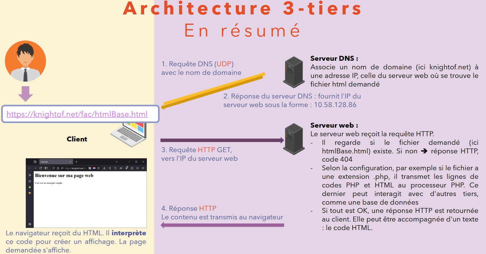
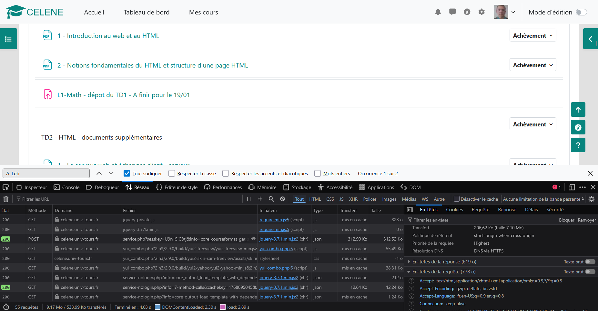

# Bilan TD1 + TD2 — Ce que vous devez maîtriser

## 2) Modèle client/serveur : ce qui se passe quand je tape une URL

Quand vous tapez une URL, le **client** (votre navigateur) demande une ressource à un **serveur** (ordinateur distant qui répond). Le serveur renvoie une réponse, et le navigateur l’affiche.

### Schéma simple des étapes

- 0. Vous tapez une **URL**

Résolution DNS : le navigateur demande au serveur DNS l’adresse IP correspondant au nom de domaine.

- 1. Résolution **DNS** (nom de domaine)
- 2. Réponse du serveur DNS (adresse IP)

Ensuite, le navigateur contacte le serveur à cette adresse IP.

- 3. Envoi d’une **requête HTTP**, avec une méthode (GET/POST)
- 4. Réception d’une **réponse HTTP** (avec statut, en-têtes, contenu)
- 5. Affichage par le navigateur du contenu reçu.

C'est le modèle **client/serveur** et il fonctionne ainsi pour chaque ressource (page HTML, image, CSS, etc.). Par analogie, c’est comme dans un restaurant : le client commande (requête), la cuisine prépare (traitement serveur éventuel), le serveur apporte l’assiette (réponse), le client mange (affichage).

**A retenir :**

- Client (navigateur) ≠ serveur (machine qui répond).
- HTTP = échanges requête/réponse.
- DNS = transforme un nom en “adresse”.

> [Sur CELENE : 4a Echanges client-serveur web](https://celene.univ-tours.fr/mod/resource/view.php?id=902400)
> 
> [Sur CELENE : Le serveur web et échanges client - serveur](https://celene.univ-tours.fr/mod/resource/view.php?id=902950)

### HTTP : requête, réponse, codes de statut, en-têtes

HTTP est le protocole d’échange entre client et serveur : le client envoie une **requête**, le serveur renvoie une **réponse**. Une réponse a un **code de statut** (succès, erreur…) et des **en-têtes** (informations sur le contenu).

#### Codes de statut à reconnaître

- `200` : OK (tout va bien)
- `404` : Not Found (ressource introuvable)
- `500` : erreur serveur (quelque chose a cassé côté serveur)

#### Quelques éléments de l'en-têtes de la réponse à connaître

- `Content-Type` : type du contenu (HTML, image, etc.)
- `Content-Length` : taille
- `Date` : date de la réponse
- `Last-Modified` : date de dernière modification
- `Server` : info sur le logiciel serveur

**A retenir :**

- HTTP = requête + réponse.
- Statut `200/404/500` à reconnaître.
- En-têtes = infos utiles sur la requete et la réponse.

### Savoir observer une requête dans les outils de développement du navigateur

Les outils de développement web permettent de voir les échanges entre navigateur et serveur. Dans l’onglet Réseau/Network, vous voyez chaque requête : URL, méthode (GET/POST), statut, et détails.

C'est très utile pour déboguer : vous pouvez vérifier ce qui a été envoyé et reçu, nottamment pour les formulaires.

### À savoir faire (procédure)

1. Ouvrir DevTools : `F12` (ou clic droit → Inspecter)
2. Onglet **Network / Réseau**
3. Cocher “Conserver les journaux” si besoin
4. **Recharger** la page
5. Cliquer une requête → lire :

   - URL
   - Méthode (GET/POST)
   - Status (200/404/…)
   - En-têtes de la requête et de la réponse

### Serveur vs fichier local

Ouvrir un fichier HTML directement avec le navigateur peut permettre de tester rapidement; il s'agit d’un accès **local** via le protocole `file://`.

Mais il est important de comprendre que ce n’est pas la même chose que d’accéder à une page via un **serveur web** (même local) avec le protocole `http://...`. Lire un fichier en `file://...` ne permet pas d'utiliser les fonctionnalités liées au protocole HTTP (comme les requêtes, les en-têtes, etc.) ni au serveur de répondre aux requêtes et effectuer des traitements.

Afin de tester vos pages dans des conditions proches de la réalité, il est recommandé d’utiliser un **serveur web local** (comme XAMPP, WAMP, etc.) qui simule le comportement d’un serveur distant. Avec un serveur web local, vous accédez généralement à vos pages via `http://localhost/...`, ce qui permet de mieux comprendre le modèle client/serveur et d’utiliser pleinement les fonctionnalités du web.

Dans un contexte d’apprentissage, il est donc crucial de distinguer entre :

- **Accès local** (`file://`) : simple, mais limité.
- **Accès via serveur web** (`http://localhost/...`) : plus réaliste, permet de comprendre le fonctionnement du web.

Si vous souhaitez héberger vos pages pour qu’elles soient accessibles sur Internet, vous devrez utiliser un **serveur distant** (hébergement web) qui répondra aux requêtes des utilisateurs.
