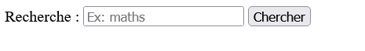
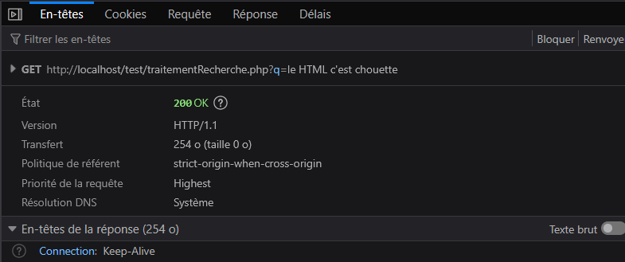
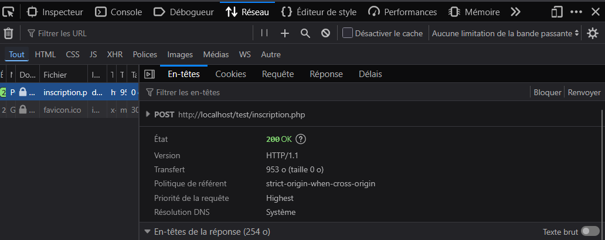
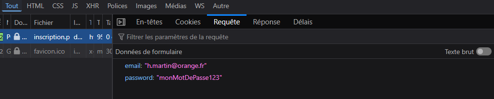
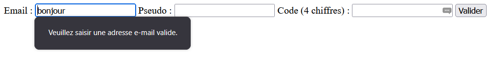
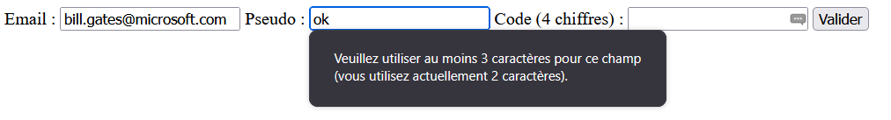

# Bilan TD1 + TD2 — Ce que vous devez maîtriser

## 3) Les formulaires : construire, envoyer des données, GET vs POST

Un formulaire HTML sert à **collecter** des données et à les **envoyer**. Le navigateur envoie alors une requête au serveur (ou vers une URL), avec les champs encodés en paires `clé=valeur`.

Le formulaire utilise obligatoirement la balise `<form>`, avec des attributs `action` (URL de destination, c'est-à-dire où envoyer les données du formulaire) et `method` (GET ou POST).

La méthode d'envoi détermine comment les données sont transmises :

- **GET** : les données sont ajoutées à l’URL sous forme de chaîne de requête (query string). Utile pour les recherches ou les formulaires non sensibles. Par exemple : `?q=maths&lang=fr` (on observe donc les données dans l’URL, ici deux paramètres `q` et `lang` avec comme valeur `maths` et `fr`).
- **POST** : les données sont envoyées dans le corps de la requête HTTP. Utile pour les formulaires sensibles (inscriptions, connexions) ou volumineux. Les données ne sont pas visibles dans l’URL.

> [Sur CELENE : 4b. HTML : Formulaires HTML5 Vue d'ensemble](https://celene.univ-tours.fr/mod/resource/view.php?id=902401)
>
> [Sur CELENE : 4c. HTML : Formulaires HTML 5 Affichages, Boutons](https://celene.univ-tours.fr/mod/resource/view.php?id=902402)
>
> [Sur CELENE : 4d. HTML : Formulaires HTML 5 Listes, Radios et Checkboxes](https://celene.univ-tours.fr/mod/resource/view.php?id=902403)
>
> [Sur CELENE : 4e. HTML : Formulaires HTML5 Saisie, Présentation Fichier](https://celene.univ-tours.fr/mod/resource/view.php?id=902404)

### Exemples : formulaire simple (GET)

**Légende :** Exemple d’un formulaire de recherche utilisant la méthode GET :

```html
<!-- Formulaire GET : les données apparaissent dans l'URL -->
<form action="traitementRecherche.php" method="get">
  <!-- for + id : associer le label au champ (accessibilité) -->
  <label for="inputRecherche">Recherche :</label>
  <!-- name : clé envoyée au serveur -->
  <input id="inputRecherche" name="q" type="text" placeholder="Ex: maths" />

  <button type="submit">Chercher</button>
</form>
```



Coté HTML on a ici :

- `<form>` : définit le formulaire.
  - attribut `action` : URL où les données sont envoyées.
  - attribut `method` : méthode d’envoi, ici GET.
- `<label>` : étiquette pour un champ (améliore l’accessibilité).
  - attribut `for` : permet de relier le label à l’`id` du champ. Ici `inputRecherche`.
- `<input>` : champ de saisie.
  - attribut `name` : nom de la donnée envoyée (clé, ici `q`).
  - attribut `type` : type de champ (texte `text`, mot de passe `password`, email `email`, nombre `number`, etc.).
  - attribut `id` : identifiant unique du champ (lié au label); pourra être ciblé en CSS ou en JavaScript.
  - attribut `placeholder` : texte indicatif affiché dans le champ avant saisie.
- `<button>` : bouton pour soumettre le formulaire.

Ce formulaire envoie une requête GET à `traitementRecherche.php` avec la donnée `q=...` dans l’URL. Par exemple, si l’utilisateur tape “maths”, l’URL sera : ```traitementRecherche.php?q=maths```. Ici, la cible est un script PHP, mais ça peut être n’importe quelle URL.

### Exemple : formulaire simple (POST)

**Légende :** Exemple d’un formulaire d’inscription utilisant la méthode POST :

```html
<!-- Formulaire POST : les données ne sont pas visibles dans l'URL -->
<form action="inscription.php" method="post">
  <label for="email">Email :</label>
  <input id="email" name="email" type="email" />

  <label for="mdp">Mot de passe :</label>
  <input id="mdp" name="password" type="password" />

  <button type="submit">S'inscrire</button>
</form>
```

Coté HTML on a ici :

- `<form>` : définit le formulaire.
  - attribut `action` : URL où les données sont envoyées.
  - attribut `method` : méthode d’envoi, ici POST.
- `<label>` : étiquette pour un champ.
  - attribut `for` : permet de relier le label à l’`id` du champ. Ici `email` et `mdp`.
- `<input>` : champ de saisie.
  - attribut `name` : nom de la donnée envoyée (clé, ici `email` et `password`).
  - attribut `type` : type de champ (email, mot de passe).
  - attribut `id` : identifiant unique du champ (lié au label).
- `<button>` : bouton pour soumettre le formulaire.

### À savoir vérifier dans l'onglet Réseau des outils de développement du navigateur

- GET : vous voyez `?q=...` dans l’URL de la requête
- POST : vous voyez les champs dans “Requête / Données envoyées” (selon navigateur)

**Légende :** Exemple d’une requête GET. Dans le formulaire, l’utilisateur a tapé "le HTML c'est chouette" :



**Légende :** Exemple d’une requête POST. Dans le formulaire, l’utilisateur a tapé "<h.martin@orange.fr>" et "monMotDePasse123". On n'observe pas les données dans l’URL :



**Légende :** Suite de l’exemple d’une requête POST. On voit ici les données envoyées dans le corps de la requête (Sous-onglet "Requête" → "Données envoyées") :



**A retenir :**

- Coté HTML, un formulaire est toujours défini par une balise `<form action="URL" method="GET|POST">`. A l’intérieur, on met des champs `<input>`/`<textarea>`/`<select>`/etc. avec un attribut `name`.
- L'attribut `name` est indispensable : sans lui, la donnée n’a pas de “clé” et ne pourra pas être récupérée côté serveur.
- GET → données dans l’URL ; POST → données dans le corps de la requête HTTP.
- On peut toujours vérifier ce qui part, peu importe la méthode, dans l’onglet Réseau/Network des DevTools.

### Champs d'un formulaire : types courants

Voici quelques types de champs courants dans les formulaires HTML :

**Les champs de saisie :**

- `<input type="text" />` : champ texte simple.
- `<input type="password" />` : champ mot de passe (texte masqué).
- `<input type="email" />` : champ email (validation de format).
- `<input type="number" />` : champ nombre (avec flèches pour augmenter/diminuer).

Pour ces champs de saisie, l'attribut `name` est obligatoire pour que la donnée soit envoyée. L'attribut `id` est optionnel mais recommandé pour lier un `<label>` au champ. On peut aussi ajouter des attributs comme `placeholder` pour ajouter un texte indicatif, ou `value` pour une valeur par défaut.

**Les cases à cocher :**

- `<input type="radio" />` : bouton radio (sélection unique parmi plusieurs). Pour grouper des boutons radio, ils doivent partager le même attribut `name`.
- `<input type="checkbox" />` : case à cocher (sélection multiple possible). Pour grouper des cases à cocher, elles peuvent partager le même attribut `name` si elles font partie d’un même groupe; on ajoutera souvent `[]` à la fin du nom pour indiquer qu’il s’agit d’un tableau de valeurs (ex: `name="interests[]"`).

**Autres champs :**

- `<textarea></textarea>` : zone de texte multi-lignes.
- `<select><option>...</option></select>` : liste déroulante.

  ```HTML
    <select name="pays">
        <option value="fr">France</option>
        <option value="us">États-Unis</option>
        <option value="uk">Royaume-Uni</option>
    </select>
  ```

  Ici, l’attribut `value` dans `<option>` définit la valeur envoyée au serveur si cette option est sélectionnée. Donc, si l'utilisateur choisit "France", la donnée envoyée sera `pays=fr`.

  - Si l'on ajoute l'attribut `multiple`, on peut sélectionner plusieurs options. Exemple :

  ```HTML
    <select name="fruits[]" multiple>
        <option value="pomme">Pomme</option>
        <option value="banane">Banane</option>
        <option value="cerise">Cerise</option>
    </select>
  ```

- `<input type="file" />` : champ pour sélectionner un fichier à envoyer.
- `<input type="hidden" />` : champ caché, non visible par l’utilisateur, mais dont la valeur est envoyée avec le formulaire.

### Validation côté client (formulaires) : empêcher les erreurs simples avant envoi

La validation côté client, c’est ce que le navigateur peut vérifier **avant** d’envoyer le formulaire : champ requis, format email, longueur minimale, motif (pattern), etc. Ça améliore l’expérience utilisateur (on évite d’envoyer des données absurdes).

### Validation HTML

**Légende :** “Exemples d’attributs de validation intégrés au navigateur.” :

```html
<form action="/inscription" method="post">
  <label for="email">Email :</label>
  <!-- type=email : vérifie un format d'email -->
  <!-- required : obligatoire -->
  <input id="email" name="email" type="email" required />

  <label for="pseudo">Pseudo :</label>
  <!-- minlength/maxlength : longueur -->
  <input id="pseudo" name="pseudo" type="text" minlength="3" maxlength="20" required />

  <label for="code">Code (4 chiffres) :</label>
  <!-- pattern : une expression régulière simple -->
  <input id="code" name="code" type="text" pattern="[0-9]{4}" required />

  <button type="submit">Valider</button>
</form>
```

Dans cet exemple :

- Le champ email doit être au format email et est obligatoire (`type="email" required`). Ainsi, si l’utilisateur tape “bonjour” au lieu d'une adresse email (comme `bill.gates@microsoft.com`), le navigateur affiche un message d’erreur.
- Le pseudo doit faire entre 3 et 20 caractères (`minlength="3" maxlength="20"`) et est obligatoire  `required`).
- Le code doit correspondre au motif de 4 chiffres (`pattern="[0-9]{4}"`) et est obligatoire (`required`). [Sur CELENE : 5. Expressions régulières (ou Regex ou Patterns) : introduction](https://celene.univ-tours.fr/mod/resource/view.php?id=902405)

**Légende :** “Exemples de messages d’erreur affichés par le navigateur lors de la validation.” :





**A retenir :**

- Validation HTML : `required`, `type`, `minlength`, `maxlength`, `pattern`.
- Ça aide l’utilisateur, mais ce n’est pas une sécurité **totale**. On vérifiera aussi les données côté serveur plus tard.
