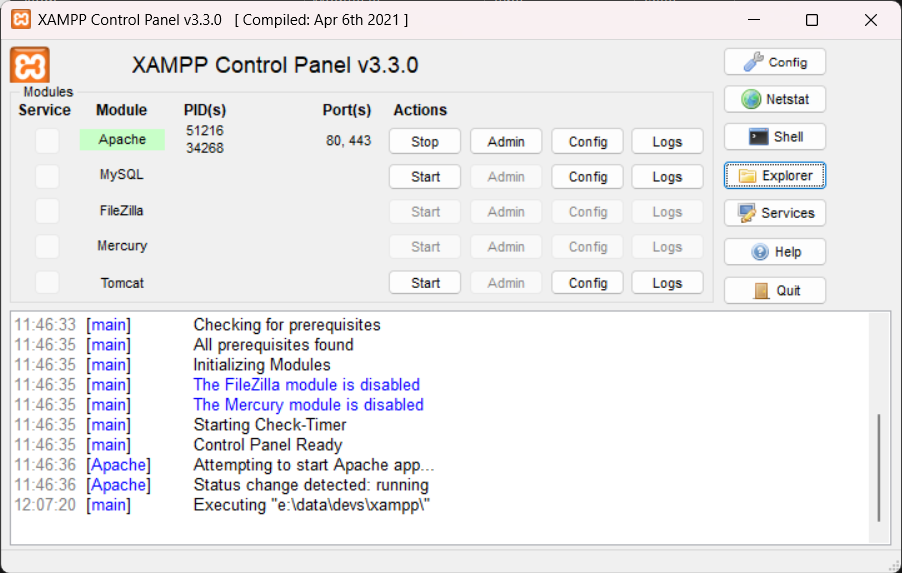
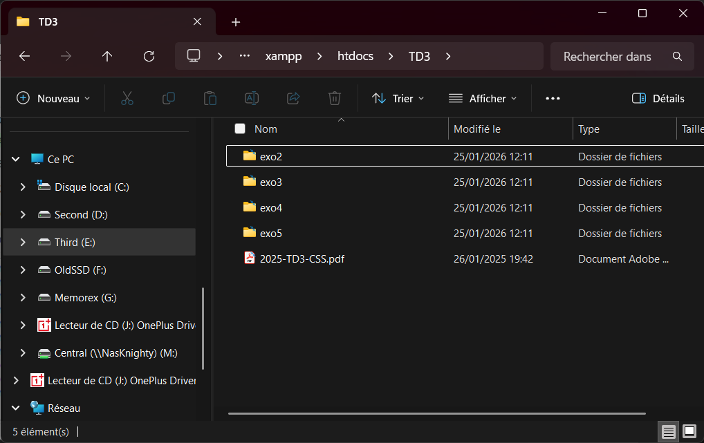
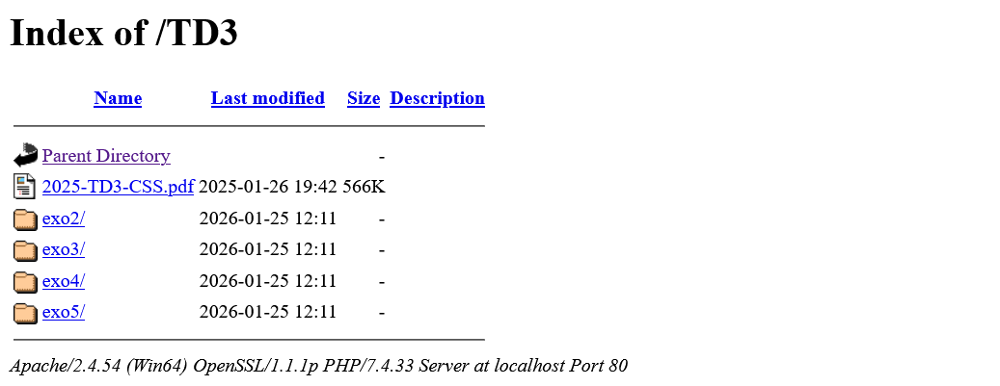

# Bilan TD1 + TD2 — Ce que vous devez maîtriser

## 4) Utiliser un serveur web sous Windows avec XAMPP

Un serveur web local sert à tester vos pages en conditions “réalistes” : URL en `http://localhost`, requêtes HTTP, et plus tard PHP/BDD. XAMPP est un paquet qui installe facilement un serveur web local.

**Intérêt / objectif :**

Arrêter de travailler uniquement en `file://` et se rapprocher d’un vrai fonctionnement client/serveur. C’est indispensable dès qu’on fait des formulaires + traitements serveur (plus tard).

> Pourquoi `localhost` ? C'est votre propre ordinateur qui fait office de serveur web. `localhost` est un nom spécial qui désigne l'ordinateur local. L'adresse IP associée est `127.0.0.1`.

### Ce que vous devez savoir faire (procédure générale)

> ⚠️ Les écrans peuvent varier selon les versions de Windows et de XAMPP.

1. Installer XAMPP

   - Téléchargez XAMPP depuis le [site officiel](https://www.apachefriends.org/fr/index.html).
   - Lancez l’installeur et gardez les options par défaut.

2. Lancez le panneau de contrôle XAMPP

   - Ouvrez **XAMPP Control Panel** (depuis le menu Démarrer par exemple).
   - Démarrez **Apache** (bouton “Start”)
   

3. Mettez vos fichiers dans le dossier servi par Apache

   - Le serveur Apache a un dossier “racine” (souvent `htdocs`. Dans la fenêtre XAMPP, cliquer sur “Explorer” pour ouvrir l’explorateur Windows à l’emplacement correct).
   - Créez un dossier de projet, par exemple :
     - `htdocs/TD3/`
     - puis mettez dedans vos fichiers HTML (ex: `index.html`, etc.) et autres ressources (CSS, images, etc.).
     

4. Accédez à votre site
   - Ouvrez un navigateur et allez sur :
     - `http://localhost/TD3/`
     

**A retenir :**

- XAMPP + Apache = serveur web local.
- Vos fichiers doivent être dans le dossier servi (ex: `htdocs`). XAMPP utilise le dossier `htdocs` par défaut, comme racine du serveur web. C'est l'équivalent du dossier `public_html` sur les machines Linux de la fac.
